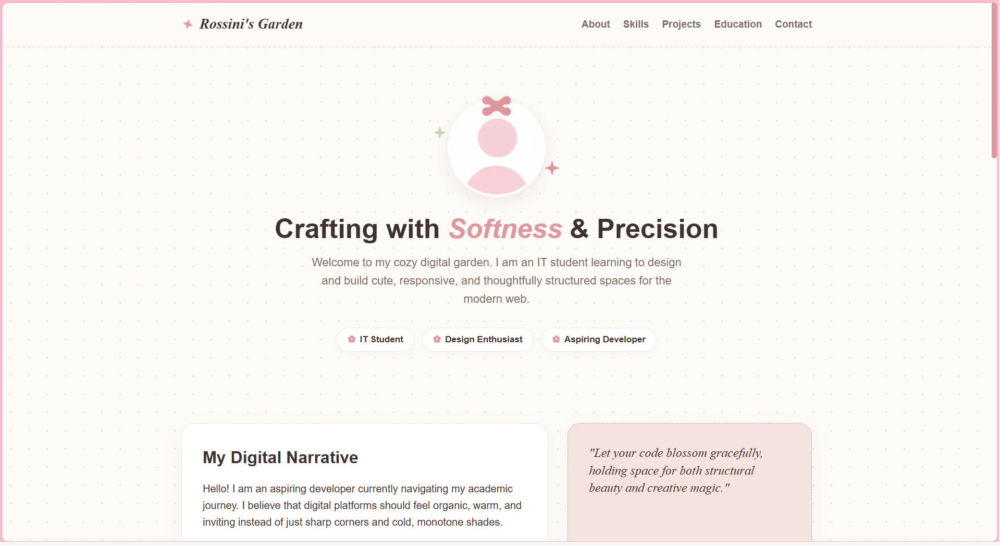
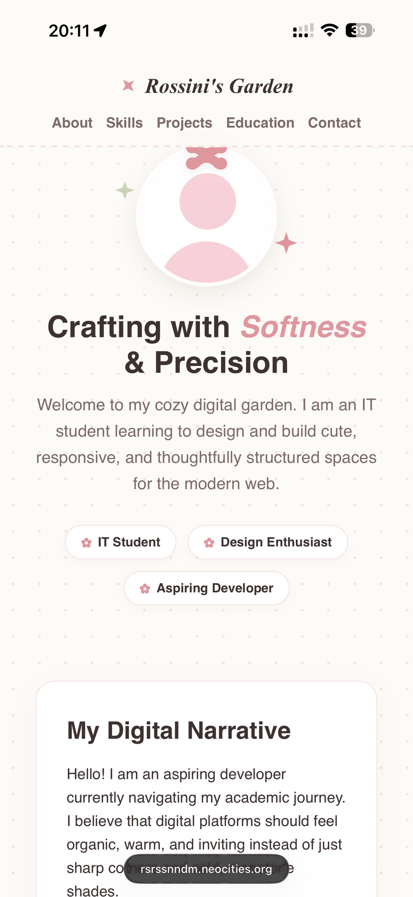

# ✿ My Portfolio Garden (Endoma's Garden) ✿

A charming, highly responsive personal portfolio website designed with a soft touch of girlhood. Built with elegant typography, warm pastel cream and rose tones, custom inline SVG details (bows, flowers, and sparkles), and complete mobile-first layout fluidity.

## 🌸 Live Website Link

✨ **Live Site:** [https://rsrssnndm.neocities.org](https://rsrssnndm.neocities.org) ✨

---

## 🎀 Project Description

This digital atelier serves as my personal portfolio website, designed to showcase my academic path, technical skillset, and creative philosophy as an IT student.

Instead of stark, monotone structures, this space is designed as a cozy digital garden. It balances technical precision and modern responsive design principles with organic, aesthetic visual details. It includes:

*   **🌸 The Profile Section:** An introduction to my journey as an aspiring developer.
*   **🌿 The Floral Toolset:** A clean, responsive grid highlighting my tech stack with custom-styled icons.
*   **✨ The Secret Garden (Projects):** Elegantly structured, responsive card placeholders for upcoming developmental creations.
*   **📚 Academic Path:** A beautifully aligned vertical education timeline built using clean CSS elements.
*   **✉️ Letterbox:** A fully styled contact form.

---

## 🎨 Technologies Used

*   **HTML5** – Semantic HTML for clean, structured, and accessible document markup.
*   **CSS3** – Custom properties, responsive Flexbox/Grid systems, and standard-compliant layout rules to ensure perfect compatibility with retro-hosting servers like Neocities.
*   **Google Fonts** – *Playfair Display* (for vintage serif accents) and *Quicksand* (for clean, readable body copy).
*   **Vector Graphics (Inline SVGs)** – Hand-drawn lightweight vector shapes (ribbons, floral motifs, and magical sparkles) that scale infinitely without slow loading times.

---

## 📸 Screenshots

### 💻 Desktop Layout View

### 📱 Mobile Responsive View

---

> “Let your code blossom gracefully, holding space for both structural beauty and creative magic.” 
> 
> *Created with love and precise layout alignment ✿*
